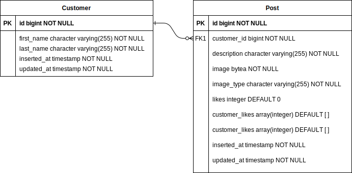

# Minig - Minimalist Instragram API
> This application was generated with `phx.new` command to facilitate application initialization.
> Commands were also used to generate migrations.

The application consists of a feature limited "Instagram" clone, with the following features:
  - Upload images with a description
  - Fetch posts with pagination
  - Like posts

#### Prerequisites
  - Erlang/OTP:22 or greater
  - Elixir:1.10.3 or greater
  - Postgres (or use docker provided :wink: )
  - Docker and Docker compose (optional)

#### To start your Phoenix server:
  * Start Postgres DB with Docker `cd utils/; ./start.sh; cd -`
  * Install dependencies with `mix deps.get`
  * Create and migrate your database with `mix ecto.setup`
  * Start Phoenix endpoint at [localhost:4000](localhost:4000) with `mix phx.server`

#### docker-compose
  Or use docker-compose and saved a lot of work :gem:

  `docker-compose up -d --build`

#### Database schema


#### Available API
> To see all available endpoints `mix phx.routes`

##### Post struct
```
Post :: {
 id :: integer,
 image :: base64,
 description :: string,
 image_type :: string,
 likes :: integer,
 customer_id :: integer,
 inserted_at :: timestamp,
 updated_at :: timestamp
}
```

##### Create a new Post
Returns json data with a new post if it is succesfully created
- **URL**: /minig/v1/post
- **Method**: POST
- **URL Params**: None
- **Data Params:** (Content-Type multipart/form-data)
    - customer\_id :: integer
    - description :: string
    - image :: file_path
- **Success Response**:
    - status_code: 201
    - body: Post

- **Error Response**
    - status_code: 404 | 500
    - body: {errors: {detail: String}}
- **Sample call**
> To test the application there are three Customers created with seeds with IDs
> 1, 2 and 3
```
curl -F 'image=@path/to/image' -F 'customer_id=1' -F 'description=A nice description' http://localhost:4000/minig/v1/post
```

##### Like an existing post
Returns json data with the updated post
- **URL**: /minig/v1/post/:post_id/:customer_id/like
- **Method**: PATCH
- **URL Params**: None
- **Data Params:** None
- **Success Response**:
    - status_code: 200
    - body: Post

- **Error Response**
    - status_code: 404 | 500
    - body: {errors: {detail: String}}
- **Sample call**
```
curl --request PATCH http://localhost:4000/minig/v1/post/1/1/like
```

##### Fetch all posts with pagination
Returns a list with all posts.
Default pagination: page_size=10&page_number=1
- **URL**: /minig/v1/post/
- **Method**: GET
- **URL Params**:
    - page_number :: integer
    - page_size :: integer
- **Data Params:** None
- **Success Response**:
    - status_code: 200
    - body:
    ```
    {entries :: [Post],
     page_size :: integer,
     page_number :: integer,
     total_entries :: integer,
     total_pages :: integer}
    ```
- **Error Response**
    - status_code: 500
    - body: {errors: {detail: String}}
- **Sample call**
```
curl http://localhost:4000/minig/v1/post
```

#### Fetch customer posts
Returns a list with all posts.
Default pagination: page_size=10&page_number=1
- **URL**: /minig/v1/post/:customer_id
- **Method**: GET
- **URL Params**:
    - page_number :: integer
    - page_size :: integer
- **Data Params:** None
- **Success Response**:
    - status_code: 200
    - body:
    ```
    {entries :: [Post],
     page_size :: integer,
     page_number :: integer,
     total_entries :: integer,
     total_pages :: integer}
    ```
- **Error Response**
    - status_code: 404 | 500
    - body: {errors: {detail: String}}
- **Sample call**
```
curl http://localhost:4000/minig/v1/post/1
```
